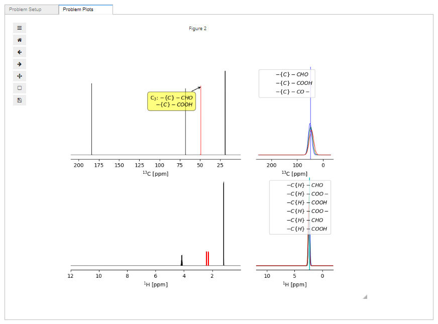

# simpleLiquidNMRanalysisVoila
Heroku/Voila/Jupyter python notebook  to help with analysis of  liquid state NMR data

#### Introduction

The analysis of liquid state NMR spectra to identify/verify/check the structure of a molecule is an important analytical procedure.

One step in the procedure is to identify the probable functional group that a peak in the proton and carbon NMR spectrum represents. Does the peak arise from a proton/carbon atom that is part of a methyl, ethyl, hydroxyl group for example. The position of the peak along the x-axis,its chemical shift,  is determined by the chemical group the atom is in or next to, or its bonding environment.

Many text books on the use of liquid state NMR to analyse chemical structure have tables of chemical shift ranges corresponding to a chemical group as appendices.  The idea behind this project is to take this information and use it to identify the peaks in a proton or carbon NMR spectrum.

The figure below illustrates the idea.





When the cursor hovers over a peak, a label pops up giving the most likely assignments for the peak. Also if other information from experiments is available, for example HSQC proton carbon connectivity information, the corresponding connected peak in the proton/carbon spectrum is highlighted. To the right, the likelihood distributions are displayed for the peak position to give the user an idea how much weight should be put on the different suggestions.

The plots are programmed using matplotlib and the interactive libraries mplcursor and ipympl. In the future, if the project develops and is useful, different plotting libraries may be used in order to speed up the responsiveness of the plots when deployed as a web application using voila and herouku.

At the moment I am concentrating on the algorithms that make the decision what chemical groups the NMR peak may arise from.

#### Requirements

```
python: 3.8.5
matplolib: 3.3.2
mplcursors: 0.4
ipympl: 0.5.8
numpy: 1.19.2
pandas: 1.1.3
scipy: 1.5.2
ipywidgets: 7.5.1
ipysheet: 0.4.4
nmrglue: 0.8
```

